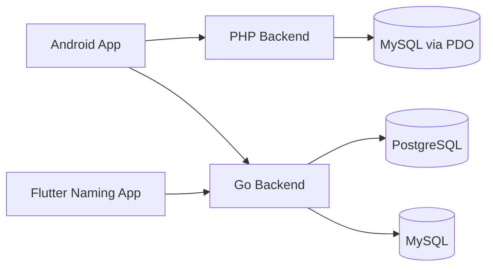

# Architecture

## System Overview

The monorepo is organized as two clients and two backends:
- `number-androidx`: broad mobile app experience
- `flutter-naming`: naming-focused client
- `number-php`: member/content/notification/admin backend
- `go-naming`: naming/chat/astrology backend

## High-Level Flow

## Client Responsibilities

### Android
- Handles auth/member profile, news/content, rengyam calendar UI, notifications, chat/product/admin screens.
- Uses Retrofit with base URL `https://numberniceic.online/`.
- Calls Go endpoints directly for naming/astrology/product-style APIs when needed.

### Flutter Naming
- Focuses on name search, ranking, numerology display, saved names, and premium/paywall UX.
- Uses HTTP client code in `ApiService`.
- Delegates core scoring and semantic ranking to Go.

## Backend Responsibilities

### PHP backend
- Entry request flow:
  1. `number-php/index.php`
  2. Slim app bootstraps container, DB, renderer, middleware
  3. `app/routes.php` maps route to closure or manager/controller method
  4. `app/Managers/*` execute DB reads/writes and format response
- Typical concerns:
  - login/register/member info
  - VIP code redemption
  - lucky number and content/news flows
  - notifications API v2
  - web admin pages
  - Thai calendar / auspicious-day response assembly

### Go backend
- Entry request flow:
  1. `go-naming/main.go`
  2. DB and FCM initialization
  3. route registration with `http.HandleFunc`
  4. handlers in `handlers/`
  5. helper logic in `services/`, `astro/`, `database/`
- Typical concerns:
  - naming search and ranking
  - decode / number meaning / name root
  - semantic search and keyword expansion
  - astrology endpoints
  - wanpra and outfit APIs
  - chat and product/payment endpoints

## Data Flow Examples

### Flutter naming search
1. User enters a keyword/name in `NamingScreen`.
2. `ApiService.searchNames()` sends `POST /api/v1/name-search`.
3. Go handler `MobileSearchHandler`:
   - reads filters and semantic context
   - queries names from DB
   - computes numerology and ranking bonuses
   - returns `MobileSearchResponse`
4. Flutter deserializes to `MobileNameResult` and renders result cards.

### Android member login
1. User submits credentials in Android auth UI.
2. Retrofit calls `POST /member/login` on PHP.
3. PHP `UserController::userLogin` validates user and returns user payload.
4. Android stores and uses the returned member data, token state, and access privileges such as `rengyam_access`.

### Android rengyam calendar
1. Android asks PHP for `GET /member/lengyam` and related calendar data.
2. PHP `ThaiCalendarHelper::getAuspiciousStatus()` merges multiple calendars/sources into display tags.
3. Android `RengYamF.kt` interprets tags, filters activity-specific dates, and renders the calendar and bottom sheets.
4. Android also calls Go astronomy/wanpra helper endpoints for supporting data such as kalagni, foo days, lokawinat, and wanpra calculations.

## Important Architectural Constraints
- Naming ranking source of truth is in Go, not Flutter.
- Member/auth/notification source of truth is in PHP, not Android.
- Rengyam UI behavior in Android depends heavily on PHP-produced tags and Android-side display/filter logic.
- Some endpoints are duplicated in capability across stacks; avoid assuming one backend owns every astrology feature.

## Operational Notes
- `go-naming/main.go` currently contains production-like credentials/session constants directly in code; treat configuration carefully.
- `number-php/index.php` logs requests and session debug information locally.
- The repo contains many deploy/debug/temp artifacts; they are not the primary architecture.
